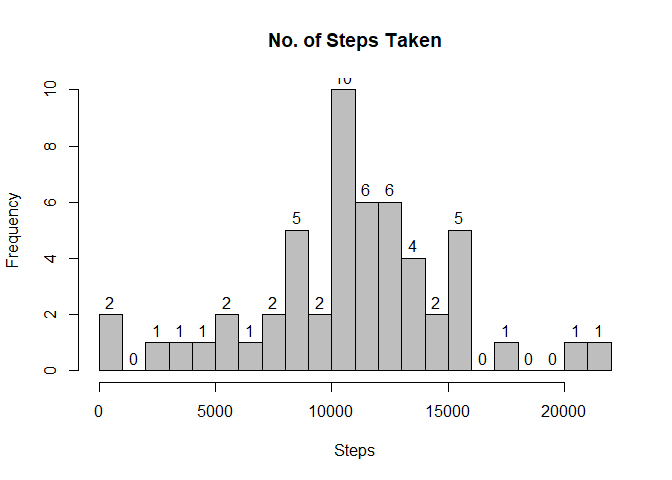
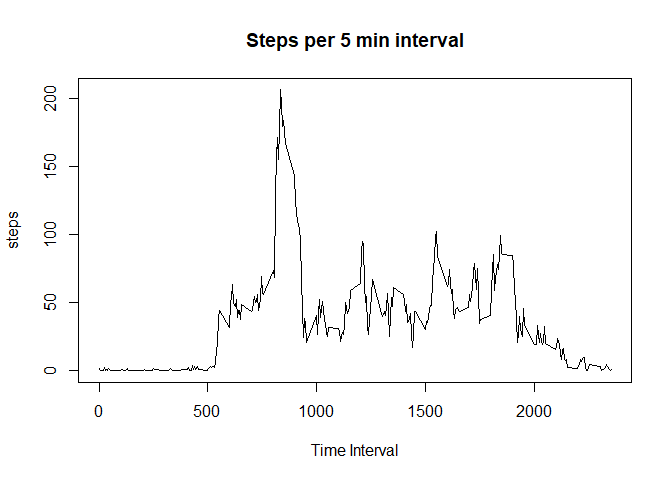
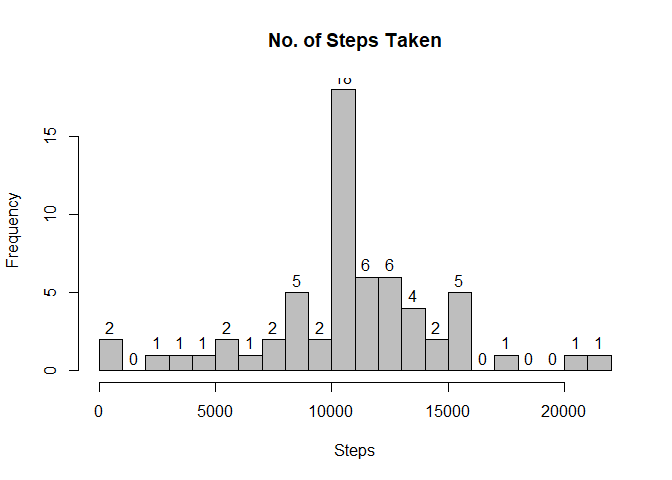
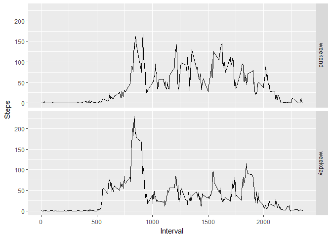

What is mean total number of steps taken per day?

Histogram of total number of steps taken each day

``` r
dat_day <- with(activity, aggregate(steps, by = list(date), sum))
colnames(dat_day) <- c("Date","Steps")
hist(dat_day$Steps, labels = TRUE, col = "gray", main = "No. of Steps Taken", xlab = "Steps", breaks = 20)
```



Calculate and report the **mean** and **median** total number of steps taken per day

``` r
mean <- mean(na.omit(dat_day$Steps))
median <- median(na.omit(dat_day$Steps))
print(mean)
```

    ## [1] 10766.19

``` r
print(median)
```

    ## [1] 10765

What is the average daily activity pattern? Make a time series plot (i.e. `type = "l"`) of the 5-minute interval (x-axis) and the average number of steps taken, averaged across all days (y-axis)

``` r
with(interval,plot(x = interval, y = steps, type = "l", main = "Steps per 5 min interval", xlab = "Time Interval"))
```



Which 5-minute interval, on average across all the days in the dataset, contains the maximum number of steps?

``` r
max(interval$steps)
```

    ## [1] 206.1698

``` r
interval[interval$steps==max(interval$steps),]
```

    ##     interval    steps
    ## 104      835 206.1698

Interval 835 with 206 steps.

Calculate and report the total number of missing values in the dataset (i.e. the total number of rows with `NA`s)

``` r
na_subset <- activity[is.na(activity$steps),]
print(dim(na_subset))
```

    ## [1] 2304    3

There are 2304 missing values.

Devise a strategy for filling in all of the missing values in the dataset. The strategy does not need to be sophisticated. For example, you could use the mean/median for that day, or the mean for that 5-minute interval, etc. Create a new dataset that is equal to the original dataset but with the missing data filled in.

``` r
activity_complete <- activity
NAs <- is.na(activity_complete$steps)
df_activity <- subset(activity, !is.na(activity$steps))
int_avg <- tapply(df_activity$steps, df_activity$interval, mean, na.rm = TRUE, simplify = TRUE)
activity_complete$steps[NAs] <- int_avg[as.character(activity_complete$interval[NAs])]
```

Make a histogram of the total number of steps taken each day and Calculate and report the **mean** and **median** total number of steps taken per day.

``` r
new_dat_day <- with(activity_complete, aggregate(steps, by = list(date), sum))
colnames(new_dat_day) <- c("Date","Steps")
hist(new_dat_day$Steps, labels = TRUE, col = "gray", main = "No. of Steps Taken", xlab = "Steps", breaks = 20)
```



``` r
mean(new_dat_day$Steps)
```

    ## [1] 10766.19

``` r
median(new_dat_day$Steps)
```

    ## [1] 10766.19

Do these values differ from the estimates from the first part of the assignment? These values differ slightly. The original median was 10765 and increased to 10766. Consequently, the histogram indicates that imputing missing data yields higher frequency counts closer to the mean.

Are there differences in activity patterns between weekdays and weekends?
=========================================================================

Create a new factor variable in the dataset with two levels -- "weekday" and "weekend" indicating whether a given date is a weekday or weekend day.

``` r
weekday_names <- c("Monday","Tuesday","Wednesday","Thursday","Friday")
activity_complete$dayType <- factor((weekdays(as.Date(activity_complete$date))%in% weekday_names),
                        levels = c(FALSE,TRUE), labels = c("weekend","weekday"))
head(activity_complete)
```

    ##       steps       date interval dayType
    ## 1 1.7169811 2012-10-01        0 weekday
    ## 2 0.3396226 2012-10-01        5 weekday
    ## 3 0.1320755 2012-10-01       10 weekday
    ## 4 0.1509434 2012-10-01       15 weekday
    ## 5 0.0754717 2012-10-01       20 weekday
    ## 6 2.0943396 2012-10-01       25 weekday

Make a panel plot containing a time series plot (i.e. `type = "l"`) of the 5-minute interval (x-axis) and the average number of steps taken, averaged across all weekday days or weekend days (y-axis).

``` r
require(ggplot2)
new_weekend_data <- with(activity_complete, aggregate(steps, by = list(interval,dayType), mean))
head(new_weekend_data)
```

    ##   Group.1 Group.2           x
    ## 1       0 weekend 0.214622642
    ## 2       5 weekend 0.042452830
    ## 3      10 weekend 0.016509434
    ## 4      15 weekend 0.018867925
    ## 5      20 weekend 0.009433962
    ## 6      25 weekend 3.511792453

``` r
colnames(new_weekend_data) <- c("Interval","dayType","Steps")
ggplot(new_weekend_data, aes(Interval, Steps))+geom_line()+facet_grid(dayType~.)
```



Yes, there are differences between weekday and weekend. Weekend activity has a higher baseline and does not have the extreme peaks and valleys of the typical structured weekday.
